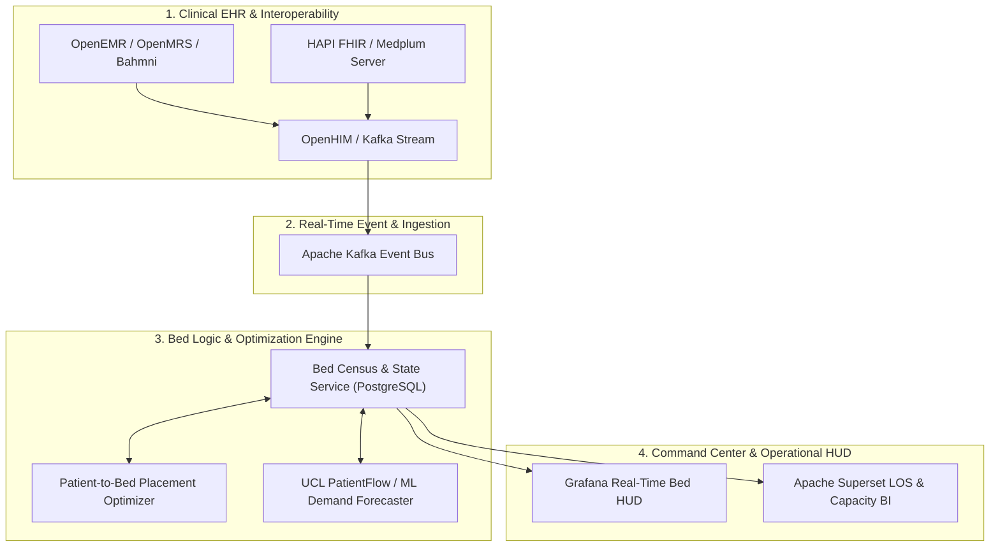

# 🏥 Awesome Hospital Bed Management 

  

---

## 🌟 Top Hospital Bed Management, Patient Flow & Capacity Intelligence Ecosystem

> 📌 **A Curated Directory of Enterprise SaaS Solutions, AI Capacity Platforms, and Open-Source Systems for Modern Healthcare Operations.**  
> *Targeting Hospital Bed Management, Patient Placement, Emergency Department (ED) Boarding, Bed Turnover, RTLS Tracking, and FHIR Interoperability.*  
> **📅 Last Updated: August 2026**

---

## 📖 Overview & SEO Summary

Efficient **Hospital Bed Management** and **Patient Flow Optimization** form the critical operational backbone of modern healthcare delivery systems. Hospitals face escalating demand, emergency department crowding, nurse staffing constraints, and lengthy turnaround delays. Modern clinical command centers integrate real-time census tracking, predictive bed forecasting, automated environmental services (EVS) turnover, and HL7/FHIR EHR interoperability.

This open repository tracks:
- 🏢 **Enterprise SaaS Platforms & Digital Command Centers**: Comprehensive commercial systems for health-system-wide bed visibility, patient routing, and capacity analytics.
- 🌐 **Open-Source Systems & Modular Components**: Developer-ready codebases, AI prediction algorithms, EHR backbones, and FHIR frameworks to build sovereign hospital capacity solutions.
- 🏗️ **Architectural Blueprints & Stack Reference**: Practical guidance on composable bed management architectures connecting EHRs, event brokers, optimization solvers, and real-time dashboard HUDs.

---

## 📑 Table of Contents

- [🏢 SaaS & Enterprise Hosted Platforms](#-saashosted-platforms)
- [🌐 Open-Source GitHub Projects](#-open-source-github-projects)
- [🏗️ Hospital Bed Management Stack Blueprint](#️-hospital-bed-management-stack-blueprint)
- [⚙️ Core Bed Management Capabilities](#️-core-bed-management-capabilities)
- [📊 Key Hospital Capacity & Flow Metrics](#-key-hospital-capacity--flow-metrics)
- [🤝 How to Contribute](#-how-to-contribute)
- [📈 Star History](#-star-history)
- [📜 Disclaimer](#-disclaimer)

---

## 🏢 SaaS/Hosted Platforms

> 📊 **Market Overview & Structure**: The global **Hospital Bed Management & Patient Flow Solutions Market** is estimated at **$2.8 Billion to $4.8 Billion** (projected to expand at a **~15.5% – 18.2% CAGR** through 2032). The market is **moderately to highly fragmented** rather than winner-take-all: dominant EHR giants (Epic, Oracle Health) control core transactional records; specialized AI predictive vendors (LeanTaaS, TeleTracking, Qventus) capture operational capacity analytics; enterprise hyperscalers (Microsoft Cloud, Palantir) drive data unification; and hardware leaders (GE HealthCare, Stryker, Sonitor) dominate telemetry beds and RTLS sensors.

*The table below is sorted in descending order by **Company Scale (Valuation / Market Cap / Annual Revenue)**:*

| 🏷️ Platform / Product | 🏢 Company Scale (Valuation / Revenue) | 🎯 Primary Focus & Capabilities | 💵 Pricing (Starting Tier) | 🎁 Free Tier / Trial Limits |
| :--- | :--- | :--- | :--- | :--- |
| **[Microsoft Cloud for Healthcare](https://www.microsoft.com/en-us/industry/health/microsoft-cloud-for-healthcare)** | **~$3.1 Trillion** Market Cap (Microsoft / ~$245B Rev) | Healthcare cloud suite with FHIR data services, operational dashboards, patient outreach, and care coordination infrastructure. | From **$95 / user / month** (Healthcare Add-On; Azure Health Data Services from $0.0004 / request) | **Free Plan**: Azure Health Bot includes **3,000 messages/month free**; offers a **30-day trial** for Dynamics 365/Power Apps healthcare templates (25 user seats + $200 Azure credits). |
| **[Oracle Health Patient Flow](https://www.oracle.com/health/)** | **~$400+ Billion** Market Cap (Oracle / ~$53B Rev) | Core Oracle Health (Cerner) patient-placement, bed assignment, ward tracking, and transfer coordination module. | From **$25 – $50 / user / month** (or ~$5,000 / month baseline hospital unit tier) | No free-forever plan; offers a **30-day sandbox trial** environment with synthetic EHR test data for up to 10 user seats. |
| **[Oracle Health Command Center](https://www.oracle.com/health/)** | **~$400+ Billion** Market Cap (Oracle / ~$53B Rev) | Enterprise clinical and operational intelligence suite aggregating multi-facility capacity, bed utilization, and throughput data. | From **~$7,500 / month** (~$90,000 / year base operational command module) | No free-forever plan; offers a **30-day sandbox pilot** with sample multi-facility operational feeds. |
| **[CareAware Patient Flow](https://www.cerner.com/)** | **~$400+ Billion** Market Cap (Oracle / ~$53B Rev) | Real-time medical device connectivity and room-readiness tracking engine embedded within the Oracle Health ecosystem. | From **~$3,500 / month** (~$42,000 / year base CareAware deployment tier) | No free-forever plan; offers a **30-day simulated integration test** environment for up to 5 bed endpoints. |
| **[Stryker Connected Hospital](https://www.stryker.com/)** | **~$135+ Billion** Market Cap (Stryker / ~$20.5B Rev) | Smart hospital bed technology (ProCuity / iBed Care) and Vocera communication emitting real-time bed occupancy and fall-risk alarms. | From **~$15 / device / month** (or smart bed telemetry connectivity starting at ~$2,500 / bed unit base tier) | No free-forever plan; offers a **30-day connectivity test pilot** for up to 10 connected bed units. |
| **[Palantir Foundry for Healthcare](https://www.palantir.com/)** | **~$75+ Billion** Market Cap (Palantir / ~$2.8B Rev) | Enterprise ontology platform connecting EHR feeds, staffing matrices, and bed telemetry into an integrated hospital command HUD. | From **~$41,667 / month** ($500,000 / year entry enterprise tier; compute metered at ~$0.0005 / compute-sec) | No free-forever plan; offers a **30-day enterprise AIP Bootcamp / PoC** with up to 50,000 compute credits for qualified health systems. |
| **[Strata Decision Technology](https://www.stratadecision.com/)** | **~$60+ Billion** Market Cap (Roper Tech / ~$150M+ Rev) | Advanced healthcare financial planning and capacity-budgeting suite (StrataJazz) for service-line and bed utilization modeling. | From **~$3,000 / month** (~$36,000 / year base decision-support tier) | No free-forever plan; offers a **30-day guided decision-support pilot** with pre-loaded benchmark capacity metrics. |
| **[GE HealthCare Command Center](https://www.gehealthcare.com/)** | **~$40+ Billion** Market Cap (GE HealthCare / ~$19.6B Rev) | Enterprise command-center software streaming clinical and operational data for system-wide capacity planning and bed placement. | From **~$8,000 / month** (base Tile capacity analytics module; ~$100,000 / year entry suite) | No free-forever plan; offers a **60-day digital twin simulation** proof-of-concept for up to 1 hospital facility. |
| **[GE Command Center (Tiles)](https://www.gehealthcare.com/)** | **~$40+ Billion** Market Cap (GE HealthCare / ~$19.6B Rev) | Modular decision-support tiles providing predictive discharge timelines, bed assignments, and unit-level staffing constraints. | From **~$6,500 / month** (~$78,000 / year base operational tile suite) | No free-forever plan; offers a **45-day virtual sandbox trial** with sample hospital ward data. |
| **[Epic Patient Flow (Grand Central)](https://www.epic.com/)** | **~$35+ Billion** Valuation (Private / ~$4.9B Rev) | Epic's integrated Grand Central bed administration, transfer center, patient placement, and environmental services module. | From **~$1,200 / provider / year** (or Community Connect starting tier from ~$2,000 / bed / year) | No free-forever plan; offers a **30-day UserWeb sandbox / developer test** environment for certified affiliate health systems. |
| **[Infor Cloverleaf](https://www.infor.com/solutions/healthcare)** | **~$3.5+ Billion** Revenue (Koch Industries $125B+) | Industry-standard healthcare integration engine ensuring real-time HL7/FHIR message routing between EHRs, ADT feeds, and bed engines. | From **~$4,600 / month** (~$55,200 / year base integration engine license) | No free-forever plan; offers a **30-day evaluation license** restricted to non-production interface test feeds. |
| **[Infor Patient Flow](https://www.infor.com/solutions/healthcare)** | **~$3.5+ Billion** Revenue (Koch Industries $125B+) | Operational throughput solution automating bed turnover, transport dispatch, and environmental services cleaning schedules. | From **~$3,500 / month** (~$42,000 / year base patient-flow package) | No free-forever plan; offers a **30-day evaluation trial** for 1 hospital location. |
| **[Central Logic (symplr)](https://www.centrallogic.com/)** | **~$3.5+ Billion** Valuation (Clearlake / symplr ~$500M+ Rev) | Enterprise transfer center and patient-routing software orchestrating hospital access and multi-hospital bed placement. | From **~$2,500 / month** (~$30,000 / year base transfer-routing tier) | No free-forever plan; offers a **30-day guided pilot** evaluation with sample regional transfer data. |
| **[LeanTaaS iQueue](https://leantaas.com/)** | **~$1.2+ Billion** Valuation (Bain Capital & Insight Partners) | AI-powered capacity management engine predicting midday bed shortages, discharge bottlenecks, and infusion/OR capacity. | From **~$9,000 / inpatient bed / year** (entry module baseline from ~$2,500 / month) | No free-forever plan; offers a **30-day proof-of-concept / ROI simulation** pilot using retrospective EHR data. |
| **[LeanTaaS iQueue for Inpatient Flow](https://leantaas.com/products/inpatient-flow/)** | **~$1.2+ Billion** Valuation (Bain Capital & Insight Partners) | Machine-learning capacity solution tracking admissions, discharge timing, and unit-level inpatient bed allocations in real time. | From **~$3,500 / month** (~$42,000 / year base inpatient flow module) | No free-forever plan; offers a **30-day predictive discharge simulation** pilot on unit historical data. |
| **[Hospital IQ](https://www.hospiq.com/)** | **~$1.2+ Billion** Valuation (Acquired by LeanTaaS) | Predictive hospital operations platform delivering operational telemetry, predictive censuses, and perioperative flow optimization. | From **~$2,500 / month** (~$30,000 / year entry predictive analytics tier) | No free-forever plan; offers a **30-day capacity forecast pilot** on retrospective census data. |
| **[TeleTracking](https://www.teletracking.com/)** | **~$800+ Million** Valuation (Private / ~$150M+ Rev) | Pioneer in hospital bed management, patient placement, transfer center coordination, and environmental services automation. | From **£100 / bed / month** (~$130 / bed / month; base facility tier from ~$10,000 / month) | No free-forever plan; offers a **30-day proof-of-value pilot** evaluation for 1 target facility. |
| **[TeleTracking Capacity](https://www.teletracking.com/)** | **~$800+ Million** Valuation (Private / ~$150M+ Rev) | Dedicated bed capacity module delivering predictive visibility into bed demand, ICU transfers, and ED boarding queues. | From **~$3,000 / month** (~$36,000 / year module add-on tier) | No free-forever plan; offers a **30-day capacity simulation pilot** on 1 pilot unit. |
| **[TeleTracking Operations IQ](https://www.teletracking.com/)** | **~$800+ Million** Valuation (Private / ~$150M+ Rev) | Cloud-native operations analytics overlay providing executive dashboards for throughput metrics and length-of-stay drivers. | From **~$4,500 / month** (~$54,000 / year base analytics tier) | No free-forever plan; offers a **30-day operational dashboard pilot** evaluation using historical telemetry data. |
| **[Medworxx (VitalHub)](https://www.medworxx.com/)** | **~$480+ Million** Market Cap (VitalHub TSX: VHI / ~$60M+ Rev) | Clinical utilization management platform optimizing patient placement appropriateness and level-of-care capacity. | From **$1 – $15 / user / month** (or ~$1,500 / month base utilization module tier) | No free-forever plan; offers a **30-day clinical review pilot** evaluation on up to 50 active patient cases. |
| **[PerfectServe](https://www.perfectserve.com/)** | **~$400+ Million** Valuation (K1 Investment / ~$80M+ Rev) | Care team collaboration and provider on-call scheduling suite expediting discharge sign-offs and patient placement alerts. | From **$89 – $119 / on-call user / month** (or ~$400 / month base clinical communication tier) | No free-forever plan; offers a **14-day guided proof-of-concept trial** for up to 15 clinical users. |
| **[Qventus](https://www.qventus.com/)** | **~$350+ Million** Valuation (Private / VC-backed / ~$40M+ Rev) | AI-driven operational automation platform managing automated discharge planning, barrier removal, and ED throughput. | From **~$2,500 / month** (~$30,000 / year base operational automation tier) | No free-forever plan; offers a **30-day structured proof-of-value pilot** limited to 1 inpatient unit. |
| **[Care Logistics](https://carelogistics.com/)** | **~$150+ Million** Valuation (Private / ~$35M+ Rev) | Centralized hospital logistics and patient progression system synchronizing bed assignments, transport, and nursing staff. | From **~$4,000 / month** (~$48,000 / year base logistics coordination tier) | No free-forever plan; offers a **30-day throughput optimization pilot** for 1 hospital site. |
| **[Sonitor Technologies](https://sonitor.com/)** | **~$100+ Million** Valuation (Private / ~$25M+ Rev) | High-definition ultrasound RTLS positioning technology tracking real-time physical room and bed occupancy. | From **~$85 / active RTLS tag / year** (or ~$1,800 / month base sensor infrastructure tier) | No free-forever plan; offers a **30-day hardware/software starter kit trial** limited to 20 RTLS tags and 5 zone receivers. |
| **[Access Patient Flow](https://www.accessexcellence.com/)** | **~$100+ Million** Valuation (Access Healthcare / ~$25M+ Rev) | Electronic forms and paperless admission workflow engine accelerating registration and bed-placement documentation. | From **~$1,500 / month** (~$18,000 / year base electronic admission tier) | No free-forever plan; offers a **14-day evaluation trial** limited to 100 digital admission forms. |

---

## 🌐 Open-Source GitHub Projects

> 💡 Open-source solutions empower hospital IT teams, researchers, and developers to build customizable, self-hosted, and vendor-neutral bed management pipelines.
> 
> *Repositories are listed in **descending order by GitHub Star Count** with direct links to stargazers:*

- **[Grafana](https://github.com/grafana/grafana)**   
  *Open and composable observability platform.* Widely used to build real-time hospital command centers, tracking ward occupancy, ICU bed availability, ED wait times, and environmental turnover status.

- **[Apache Superset](https://github.com/apache/superset)**   
  *Modern enterprise business intelligence and data exploration platform.* Ideal for building historical bed census reports, length-of-stay (LOS) dashboards, and admission capacity forecasting models.

- **[Apache Airflow](https://github.com/apache/airflow)**   
  *Programmatic workflow and pipeline orchestration.* Schedules healthcare ETL pipelines, bed-census recalculations, predictive model retraining, and nightly EHR capacity data warehousing.

- **[ERPNext Healthcare](https://github.com/frappe/erpnext)**   
  *Open-source ERP framework with built-in healthcare module.* Supports inpatient bed assignment, ward/floor management, admission/discharge workflows, and medical billing.

- **[Apache Kafka](https://github.com/apache/kafka)**   
  *Distributed event streaming platform.* Powers the real-time hospital nervous system by streaming ADT (Admission, Discharge, Transfer) events, HL7 messages, RTLS location pings, and bed-state changes.

- **[OpenEMR](https://github.com/openemr/openemr)**   
  *ONC-certified open-source electronic health records (EHR) and practice management system.* Contains inpatient tracking, encounter records, and extensible patient management backbones.

- **[Synthea](https://github.com/synthetichealth/synthea)**   
  *Synthetic patient population simulator.* Generates realistic synthetic clinical and admission records to benchmark bed-allocation algorithms without compromising patient privacy (HIPAA/GDPR).

- **[Medplum](https://github.com/medplum/medplum)**   
  *Modern developer-first healthcare platform built on FHIR.* Includes comprehensive `Location`, `Encounter`, and `Schedule` resources to model hospital beds, rooms, wards, and patient transfers.

- **[HospitalRun Frontend](https://github.com/HospitalRun/hospitalrun-frontend)**   
  *Open-source hospital management system designed for low-resource environments.* Features intuitive patient registration, admission tracking, ward bed allocations, and clinical records.

- **[HAPI FHIR](https://github.com/hapifhir/hapi-fhir)**   
  *Complete open-source HL7 FHIR Java library and JPA server.* Provides the core interoperability infrastructure required to bridge clinical EHR systems with bed management services.

- **[OpenMRS Core](https://github.com/openmrs/openmrs-core)**   
  *Extensible open-source medical record system.* Serves as a proven clinical foundation with modular ward management and inpatient visit tracking plugins.

- **[HospitalRun Monorepo](https://github.com/HospitalRun/hospitalrun)**   
  *HospitalRun core project monorepo.* Contains next-generation server architecture and data models for facility and patient journey administration.

- **[OpenBoxes](https://github.com/openboxes/openboxes)**   
  *Healthcare supply chain and inventory management software.* Manages hospital ward logistics, medical asset replenishment, and room supply stocking.

- **[MIMIC Code & Analytics](https://github.com/MIT-LCP/mimic-code)**   
  *Clinical research codebase for the MIMIC critical-care database.* Contains proven SQL scripts and machine learning pipelines for length-of-stay (LOS) prediction and ICU bed capacity modeling.

- **[Open Hospital](https://github.com/informatici/openhospital)**   
  *Free and open-source electronic hospital management software.* Offers admission management, ward bed allocation, pharmacy tracking, and laboratory workflow coordination.

- **[CoronaSafe CARE Frontend](https://github.com/ohcnetwork/care_fe)**   
  *Award-winning Digital Public Good UI for decentralized hospital network administration.* Provides real-time ICU bed census, oxygen telemetry, and regional facility capacity visualization.

- **[Marley Health Information System](https://github.com/earthians/marley)**   
  *Enterprise modern health information system built on Frappe.* Features advanced inpatient management, room scheduling, bed lifecycle status, and nurse station dashboards.

- **[CoronaSafe CARE Backend](https://github.com/ohcnetwork/care)**   
  *Production-grade healthcare facility and patient management backend.* Manages patient triaging, inter-facility bed transfers, telemedicine consultations, and capacity allocations.

- **[OHDSI Atlas](https://github.com/OHDSI/Atlas)**   
  *Open-source analytics platform for the OMOP Common Data Model.* Conducts population-level observational research, hospital stay duration modeling, and capacity epidemiological studies.

- **[Bahmni Core](https://github.com/Bahmni/bahmni-core)**   
  *Hospital information system combining OpenMRS, Odoo, and OpenELIS.* Includes integrated inpatient admission, bed booking, and patient tracking workflows.

- **[OpenHIM Core](https://github.com/jembi/openhim-core-js)**   
  *Healthcare interoperability middleware layer.* Coordinates transactional message routing and security between EHRs, lab systems, and bed management services.

- **[GNU Health](https://github.com/gnuhealth/gnuhealth)**   
  *Free and open-source Hospital Management & Health Information System.* Provides comprehensive ward management, bed tracking, and clinical encounter logging.

- **[OpenELIS Global](https://github.com/openelisglobal/openelisglobal-core)**   
  *Enterprise laboratory information system.* Supplies critical lab turnaround status data directly into patient discharge and bed turnover decision engines.

- **[UCL-CORU PatientFlow](https://github.com/UCL-CORU/patientflow)**   
  *Python package for short-term predictive hospital bed demand.* Predicts emergency department admissions and specialty bed demand using real-time patient progression data.

- **[EASPATAAL](https://github.com/gaureshpai/easpataal)**   
  *Hospital queue management and department routing system.* Coordinates patient movement through registration, triaging, outpatient clinics, and inpatient admissions.

- **[Hospital Bed Management System](https://github.com/Ansarimajid/Hospital-Management-System)**   
  *Targeted hospital bed allocation implementation.* Manages ward-level bed availability, patient admission logs, and bed occupancy statuses.

- **[VitalBed](https://github.com/iamabhrajit24/VitalBed)**   
  *Modern bed management prototype.* Features automated bed allocation rules, real-time cleaning turnover workflows, and clinical emergency escalation alerts.

- **[MediQ](https://github.com/adot-7/MediQ)**   
  *Hospital network management web application.* Implements real-time ward bed tracking, patient admission queues, and departmental resource coordination.

- **[BedFlow AI](https://github.com/draculess99/BedFlow_AI)**   
  *AI-assisted bed availability and placement prototype.* Uses machine learning heuristics to optimize patient-to-bed placement and eliminate admission bottlenecks.

- **[Hospital Bed Management & Availability](https://github.com/4devendrathakur/Hospital-bed-management-and-availability-system)**   
  *Academic implementation for hospital ward bed booking.* Provides patient admission records, room assignment forms, and status reporting.

---

## 🏗️ Hospital Bed Management Stack Blueprint

A self-hosted, enterprise-grade **Hospital Bed Management & Patient Flow Platform** can be assembled from specialized modular open-source layers:

---

## ⚙️ Core Bed Management Capabilities

- 🛏️ **Real-Time Census Matrix**: Instant status classification (`Available`, `Occupied`, `Reserved`, `Cleaning/Dirty`, `Maintenance`, `Blocked`).
- 🤖 **Predictive Placement & Specialty Routing**: AI matching of clinical acuity, nurse-to-patient staffing ratios, and infection-control isolation rules.
- ⚡ **Automated Bed Turnover**: Environmental Services (EVS) notifications triggered automatically upon patient discharge.
- 🚑 **ED Boarding & Surge Prevention**: Early-warning alerts for emergency department crowding and impending ICU capacity exhaustion.
- 🔄 **Regional Inter-Facility Transfer Center**: Seamless coordination of referrals, transport dispatch, and receiving bed guarantees.
- 📡 **RTLS Sensor & Smart Bed Telemetry**: Continuous bed weight, rail status, patient exit alarms, and ultrasound indoor positioning.

---

## 📊 Key Hospital Capacity & Flow Metrics

| 📈 Metric | 🎯 Operational Target | 📝 Description |
| :--- | :--- | :--- |
| **Bed Occupancy Rate** | 80% – 85% | Percentage of staffed beds currently occupied by admitted patients. |
| **Bed Turnaround Time (TAT)** | < 60 minutes | Duration from patient discharge until the bed is cleaned, inspected, and ready. |
| **ED Boarding Time** | < 90 minutes | Time admitted emergency patients wait in the ED before reaching an inpatient bed. |
| **Average Length of Stay (ALOS)** | Target by DRG | Average duration of inpatient hospitalization compared to geometric benchmarks. |
| **Discharge by 11:00 AM Rate** | > 35% | Percentage of daily planned discharges executed early in the day to free up midday beds. |
| **Transfer Center Decline Rate** | < 3% | Percentage of incoming transfer requests rejected due to bed or staffing shortages. |

---

## 🤝 How to Contribute

Contributions, updates, and additions are warmly welcomed!

1. 🍴 **Fork the repository**.
2. 🌿 **Create your feature branch**: `git checkout -b add-new-bed-management-tool`.
3. ✍️ **Add your entry** following the structured markdown table or badge format (include factual descriptions, starting prices, free tier limits, or star badges).
4. 🚀 **Commit your changes**: `git commit -m "Add [Tool Name] to Bed Management Ecosystem"`.
5. 📬 **Open a Pull Request** with a concise description of the addition.

---

## 📈 Star History

---

## 📜 Disclaimer

- This curated list is maintained for informational, academic, and operational research purposes and does not constitute a clinical endorsement.
- Hospital patient flow systems handle protected health information (PHI); production deployments must enforce full compliance with **HIPAA, GDPR, HITRUST, SOC2**, and applicable healthcare governance standards.
- Predictive machine-learning models and placement recommendations must serve as clinical decision support (CDS) to assist qualified hospital personnel, not replace medical judgment.
- Always review current software licensing and terms before production implementation.

---

  <b>Built with ❤️ for hospital operations teams, bed managers, and healthcare software engineers.</b>

